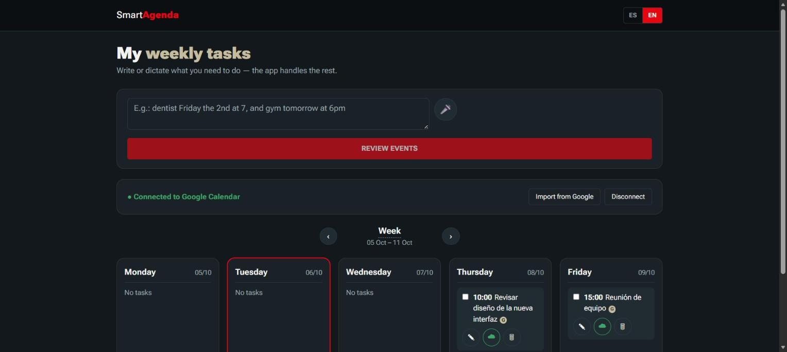
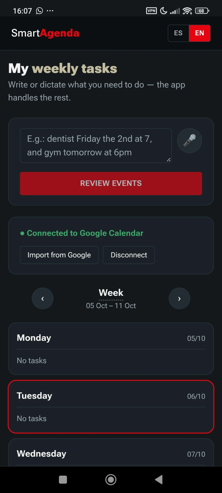

# Smart Agenda


🇬🇧 [Read in English](README.md)

Gestor de tareas autoalojado y bilingüe (ES/EN) que convierte una sola frase
en lenguaje natural —escrita o dictada— en uno o varios eventos de
calendario, con un paso de confirmación antes de guardar o sincronizar nada
con Google Calendar. Construido con Blazor Server, un motor propio de
interpretación de lenguaje natural y un pipeline de voz a texto totalmente
local y sin conexión (sin APIs de pago, sin servicios de IA externos, sin
que ningún dato salga de tu propia red).

<p align="center">
  
</p>
<p align="center">
  
  
</p>
<p align="center">
  <sub>Paso de revisión antes de confirmar (izquierda) · la misma app en el móvil, instalada como PWA (derecha)</sub>
</p>

## Por qué este proyecto es interesante

- **Comprensión de lenguaje natural bilingüe sin ninguna API de pago.**
  Los motores de interpretación en español e inglés están construidos desde
  cero con un algoritmo compartido basado en reglas (resolución de
  fecha/hora/día de la semana, segmentación de varios eventos, detección de
  ambigüedad) y tablas de vocabulario/expresiones regulares específicas de
  cada idioma — no es un envoltorio sobre un LLM. Todo se interpreta en el
  servidor, en C#.
- **Pipeline de voz totalmente local y sin conexión.** El audio se captura
  en el navegador con la API Web Audio "en crudo" (no con la API
  `SpeechRecognition`, que solo funciona bien en Chrome), se sube al
  servidor, se filtra con un modelo de detección de actividad de voz
  ([Silero VAD](https://github.com/snakers4/silero-vad), vía ONNX Runtime)
  y se transcribe con [OpenAI Whisper](https://github.com/openai/whisper)
  ejecutado localmente ([Whisper.net](https://github.com/sandrohanea/whisper.net)).
  Sin API key, sin coste por petición, el audio nunca sale del servidor.
- **Sincronización bidireccional con Google Calendar** vía OAuth2: crear,
  actualizar, eliminar e importar eventos, manteniendo sincronizados la
  lista local de tareas y Google Calendar.
- **Interfaz responsiva e instalable.** Un único árbol de componentes
  Blazor sirve tanto el diseño de escritorio como el de móvil; la app es
  una PWA instalable (manifest + service worker), así que se comporta como
  una app nativa una vez añadida a la pantalla de inicio.
- **Pensada para autoalojarse en casa**, no para desplegarse en la nube: el
  objetivo es que corra en una máquina que ya tengas encendida de forma
  permanente (una Raspberry Pi, un portátil viejo, un NAS, un sobremesa) y
  se acceda a ella de forma segura desde cualquier sitio mediante una capa
  de red privada ([Tailscale](https://tailscale.com), actualmente) — en vez
  de exponer un puerto a internet o pagar hosting. Ver [Acceso remoto y
  móvil](#acceso-remoto-y-móvil) más abajo.
- **Interfaz interactiva en tiempo real sin build de frontend aparte.**
  Blazor Server renderiza y actualiza la interfaz sobre una conexión
  SignalR persistente — no hay una capa React/Vue/webpack, todo el stack
  (interfaz + lógica de negocio) es C#.

## Funcionalidades

- Escribir o dictar tareas en español o inglés naturales, incluyendo varios
  eventos en una sola frase, con contexto temporal compartido entre ellos
  (p. ej. "dentista el viernes a las 7, y gimnasio mañana a las 18:00").
- Un paso de vista previa/confirmación antes de crear nada: las fechas
  ambiguas (p. ej. un número suelto sin día de la semana ni mes que lo
  respalde) se marcan para revisión en vez de adivinarse en silencio.
- Dictado por voz que inicia la transcripción automáticamente y detiene la
  grabación sola al detectar silencio — sin clics extra, y funciona en
  cualquier navegador moderno, no solo en Chrome.
- Selector de idioma (ES/EN) en la cabecera que cambia a la vez la
  interfaz, el idioma del analizador de lenguaje natural y el idioma de
  transcripción de Whisper, guardado por navegador.
- Vista semanal con listas de tareas por día, editables in situ, con una
  insignia de sincronización con Google Calendar por tarea.
- Flujo de conexión/desconexión con Google Calendar, sincronización manual
  e importación de eventos ya existentes en Google Calendar hacia la app.

## Stack tecnológico

| Capa | Tecnología |
|---|---|
| Interfaz / servidor | C# 13, .NET 9, Blazor Server (modo de renderizado interactivo en servidor) |
| Integración con calendario | Google Calendar API v3, OAuth2 (`Google.Apis.*`) |
| Voz a texto | [Whisper.net](https://github.com/sandrohanea/whisper.net) (inferencia local de Whisper, modelo "small") |
| Detección de actividad de voz | [Silero VAD](https://github.com/snakers4/silero-vad) vía `Microsoft.ML.OnnxRuntime` |
| Captura de audio | Web Audio API (`AudioContext`, `getUserMedia`), codificación WAV propia en JS |
| Interpretación de lenguaje natural | Motor propio basado en expresiones regulares (sin IA/LLM externo), un conjunto de reglas por idioma |
| Almacenamiento | Archivos JSON planos en disco, uno por fecha |
| Servidor web / hosting | Kestrel, con HTTPS vía certificado de Tailscale para acceso en LAN/remoto |
| Experiencia cliente | PWA (manifest + service worker), CSS responsivo, variables CSS para el tema visual |

## Arquitectura de un vistazo

```
Navegador (escritorio o móvil)
   │  texto escrito / audio grabado (Web Audio API)
   ▼
Circuito de Blazor Server (SignalR)
   │
   ├─ ParserLenguajeNaturalService   → convierte texto en uno o varios eventos propuestos
   ├─ TranscripcionAudioService      → Whisper (local) convierte audio en texto
   ├─ DeteccionVozService            → Silero VAD descarta audio sin voz real
   ├─ TareaStorageService            → lee/escribe tareas como JSON, un archivo por fecha
   └─ GoogleCalendarService          → OAuth2 + sincronización con Google Calendar API
```

Todo lo anterior a la capa de almacenamiento corre en el servidor; el
navegador solo captura la entrada (texto/audio) y renderiza la interfaz que
Blazor Server transmite de vuelta por la conexión SignalR.

## Puesta en marcha

Desde dentro de esta carpeta (`C#/SmartAgenda`):

```bash
dotnet run
```

O desde la raíz del repositorio:

```bash
dotnet run --project "C#/SmartAgenda"
```

Abre la URL que indique la consola (por defecto `http://localhost:5203`).

### Ejemplos de lenguaje natural

```
el jueves tengo que enviar el informe a las 10am
mañana recuérdame llamar al dentista a las 4 de la tarde durante 2 horas
dentista el viernes 2 a las 7, y gimnasio mañana a las 18:00
cita con el dentista a las siete de la mañana del viernes dos de octubre,
salida con mis colegas el domingo cuatro a las doce y cena con mis padres
el primero a las veinte
```

El analizador reconoce, en ambos idiomas:

- Días de la semana, `hoy`/`today`, `mañana`/`tomorrow`, `pasado
  mañana`/`day after tomorrow`, `este viernes`/`this friday`, `el próximo
  lunes`/`next monday`, `dentro de 3 días`/`in 3 days`.
- Fechas explícitas: `2 de octubre`, `el primero`, `el 4` — si mencionas el
  mes una vez, las fechas siguientes en la misma frase lo heredan
  automáticamente.
- Horas en número o en palabras: `a las 10`, `10am`, `a las siete de la
  mañana`.
- Duración con `durante 1 hora`, `durante 30 minutos` (por defecto, 1 hora).
- Varios eventos separados por comas o "y"/"and": cada uno se detecta por
  separado, salvo que el trozo tras el separador no tenga ninguna
  fecha/hora propia (entonces se pliega dentro del título del evento
  anterior).

Después de escribir o dictar, pulsa **"Revisar eventos"**: la app muestra
una vista previa de lo que entendió (título, fecha, hora y duración son
editables) antes de guardar nada. Los eventos marcados con ⚠️ no traían una
fecha clara propia — revísalos antes de confirmar. Nada se guarda ni se
envía a Google Calendar hasta pulsar **"Confirmar y crear"**.

> **Limitación conocida**: el analizador es por reglas (sin IA externa,
> gratis y sin API keys), así que un número suelto que no sea una fecha
> (p. ej. "comprar 2 cafés") puede confundirse con un día del mes. Revisa
> siempre la vista previa antes de confirmar — para eso existe ese paso.

Cada tarea se guarda en un archivo independiente por fecha dentro de
`Data/tareas/`, así que cada semana —pasada o futura— es independiente.

## Acceso remoto y móvil

La app siempre corre en una sola máquina; tu móvil (o cualquier otro
dispositivo) solo se conecta a ella. **El despliegue pensado es un pequeño
servidor doméstico siempre encendido** — una Raspberry Pi, un portátil
viejo, un NAS, un sobremesa de repuesto — para que la agenda esté disponible
24/7 sin depender de que tu PC principal esté encendido. Ahora mismo se
ejecuta y se muestra desde una máquina de desarrollo, accedida de forma
segura vía Tailscale; mover ese mismo montaje a una Raspberry Pi (.NET 9
corre de forma nativa en ARM64 / Raspberry Pi OS de 64 bits) es cuestión de
publicar la app allí y apuntar Tailscale hacia ella.

**Tailscale es la forma recomendada de acceder**, sea cual sea la máquina
donde termine corriendo: evita instalar certificados a mano y funciona
también fuera de casa.

### Opción A: Tailscale (recomendada)

[Tailscale](https://tailscale.com) crea una red privada entre tus propios
dispositivos y le da a tu servidor un certificado HTTPS **real y de
confianza automática** (vía Let's Encrypt) — el móvil no necesita instalar
ni confiar en nada manualmente, abre la URL y funciona como cualquier web
normal. Gratis para uso personal.

1. Instala Tailscale en el servidor y en tu móvil ([tailscale.com/download](https://tailscale.com/download)) e inicia sesión con la **misma cuenta** en ambos.
2. En [login.tailscale.com/admin/dns](https://login.tailscale.com/admin/dns), activa **"MagicDNS"** y **"HTTPS Certificates"**.
3. En el servidor, averigua tu dominio de Tailscale:
   ```powershell
   & "C:\Program Files\Tailscale\tailscale.exe" status
   ```
   Verás algo como `mi-servidor` — tu dominio completo es
   `mi-servidor.<tu-tailnet>.ts.net` (puedes confirmarlo en el panel web).
4. Genera el certificado (una sola vez; Tailscale lo renueva solo):
   ```powershell
   & "C:\Program Files\Tailscale\tailscale.exe" cert mi-servidor.tu-tailnet.ts.net
   ```
5. Mueve los dos archivos generados (`*.crt` y `*.key`) a la carpeta `Data/`
   de este proyecto, renombrándolos a `tailscale-cert.crt` y
   `tailscale-cert.key`.
6. Arranca la app (`dotnet run`) y, con el móvil conectado a Tailscale (en
   cualquier red, no hace falta estar en casa), entra a
   `https://mi-servidor.tu-tailnet.ts.net:7094`.

> **Nota**: una vez activo el certificado de Tailscale, `https://localhost`
> deja de validar (el certificado ya no incluye "localhost" entre sus
> dominios válidos). Usa siempre tu URL de Tailscale, también para probar
> la app desde el propio servidor — gracias a Tailscale/MagicDNS funciona
> igual ahí.

### Añadir un icono a la pantalla de inicio (sin escribir la URL cada vez)

La app es una PWA instalable: en Chrome (Android), abre la URL de
Tailscale, toca el menú **⋮** → **"Añadir a pantalla de inicio"**. Se crea
un icono que abre la app a pantalla completa, sin barra de navegador ni
volver a escribir la URL — el destino queda fijado en
`wwwroot/manifest.webmanifest`.

### Opción B: certificado autofirmado en tu red Wi-Fi local

Más manual, pero sin depender de Tailscale. Solo funciona si el móvil está
en la **misma red Wi-Fi** que el servidor.

1. **Genera el certificado** (y de nuevo si la IP local del servidor
   cambia):
   ```powershell
   .\scripts\generar-certificado-lan.ps1
   ```
   Crea `Data/dev-cert.pfx` (lo usa el servidor) y `Data/dev-cert.cer` (lo
   instalas en el móvil).

2. **Permite el acceso en el Firewall de Windows** — si la red está marcada
   como "Pública" (lo normal por defecto), el Firewall bloquea la conexión
   del móvil. Con una de estas dos basta:
   - Configuración → Red e Internet → Wi-Fi → tu red → Perfil de red →
     cámbialo a **Privada**.
   - O, en PowerShell **como administrador**:
     ```powershell
     New-NetFirewallRule -DisplayName "SmartAgenda HTTP" -Direction Inbound -Protocol TCP -LocalPort 5203 -Action Allow -Profile Any
     New-NetFirewallRule -DisplayName "SmartAgenda HTTPS" -Direction Inbound -Protocol TCP -LocalPort 7094 -Action Allow -Profile Any
     ```

3. **Arranca la app** (`dotnet run`).

4. **Instala el certificado como de confianza en el móvil** — sin esto, el
   móvil mostrará "sitio no seguro" y el micrófono seguirá bloqueado.
   Pásate `Data/dev-cert.cer` al móvil e instálalo:
   - **Android**: Ajustes → Seguridad → Más ajustes de seguridad → Cifrado
     y credenciales → Instalar un certificado → Certificado de CA.
   - **iPhone**: abre el archivo para instalar el perfil → Ajustes →
     General → VPN y gestión de dispositivos → instala el perfil → Ajustes
     → General → Información → Ajustes de confianza de certificados →
     activa la confianza total.

5. **Abre la app desde el móvil**: `https://TU_IP_LOCAL:7094` (consulta tu
   IP con `ipconfig`, busca "Dirección IPv4").

> Ninguno de estos certificados (de Tailscale o autofirmado) se sube al
> repositorio — ambos están en `.gitignore` porque incluyen la clave
> privada.

## Conectar con Google Calendar

Para poder enviar tareas a tu calendario necesitas credenciales OAuth
propias de Google Cloud (gratis, solo para tu uso personal).

### 1. Crear el proyecto en Google Cloud Console

1. Entra a [console.cloud.google.com](https://console.cloud.google.com/) e
   inicia sesión con tu cuenta de Google.
2. Crea un proyecto nuevo (por ejemplo `SmartAgenda`).
3. En el menú lateral, ve a **APIs y servicios → Biblioteca**, busca
   **Google Calendar API** y haz clic en **Habilitar**.

### 2. Configurar la pantalla de consentimiento OAuth

1. Ve a **APIs y servicios → Pantalla de consentimiento de OAuth**.
2. Elige tipo **Externo** y completa el nombre de la app y tu correo.
3. En "Usuarios de prueba", añade tu propia cuenta de Gmail.
4. Guarda (no hace falta publicarla; con modo de prueba es suficiente para
   uso personal).

### 3. Crear las credenciales

1. Ve a **APIs y servicios → Credenciales → Crear credenciales → ID de
   cliente de OAuth**.
2. Tipo de aplicación: **Aplicación de escritorio**.
3. Dale un nombre y créala. Descarga el JSON generado.

### 4. Colocar el archivo en el proyecto

Renombra el archivo descargado a `credentials.json` y colócalo en:

```
Data/credentials.json
```

(la carpeta `Data/` se crea automáticamente al ejecutar la app la primera
vez si no existe).

### 5. Conectar tu cuenta (dentro de la app, una sola vez)

En la propia app, pulsa el botón **"Conectar con Google"**. Se abrirá una
ventana de tu navegador con el inicio de sesión oficial de Google (así
funciona cualquier "Iniciar sesión con Google": por seguridad, Google no
permite hacerlo dentro de otra aplicación). Inicia sesión, acepta el acceso
al calendario, y la ventana se cierra sola. El permiso queda guardado
localmente en `Data/google-token/`, así que **no tendrás que volver a
iniciar sesión**: la app recuerda la conexión entre usos.

A partir de ahí, el uso diario es: escribes o dictas la tarea → pulsas
"Revisar eventos" → confirmas la vista previa → se guarda en la app y se
crea el evento en tu Google Calendar, sin pasos técnicos adicionales.

### Editar, eliminar e importar

- **Editar**: cada tarea tiene un botón "Editar" para cambiar el texto, el
  día, la hora o la duración. Si está conectada a Google, el evento se
  actualiza también.
- **Eliminar**: borra la tarea localmente y, si estaba sincronizada,
  también el evento en Google Calendar.
- **Importar tareas desde Google**: trae a la app los eventos que ya tengas
  en tu Google Calendar para la semana actual (por ejemplo, si los creaste
  directamente desde el móvil o la web de Google). Los eventos ya conocidos
  se actualizan y los nuevos se añaden como tareas.

> Los archivos `Data/credentials.json` y `Data/google-token/` contienen
> información sensible de tu cuenta: no los compartas ni los subas a un
> repositorio público.

## Estructura del proyecto

- `Components/Pages/Home.razor` — interfaz principal (entrada de texto/voz,
  vista previa de eventos y vista semanal).
- `Services/ParserLenguajeNaturalService.cs` — único punto de interpretación
  de lenguaje natural (texto y, tras transcribirse, también audio): detecta
  uno o varios eventos, fechas explícitas y relativas, y contexto temporal
  compartido entre ellos, tanto en español como en inglés.
- `Services/LocalizationService.cs` — traducción de los textos de la
  interfaz (ES/EN) y único punto de verdad sobre el idioma seleccionado.
- `Services/TareaStorageService.cs` — guarda/lee las tareas en JSON, un
  archivo por fecha exacta, y el nombre personalizado de cada semana.
- `Services/GoogleCalendarService.cs` — autenticación OAuth y creación de
  eventos en Google Calendar.
- `Services/DeteccionVozService.cs` — filtro previo que descarta audio sin
  voz real (música, ruido, silencio) con Silero VAD, antes de llamar a
  Whisper.
- `Services/TranscripcionAudioService.cs` — transcribe el audio grabado a
  texto con Whisper, ejecutado localmente (descarga los modelos la primera
  vez a `Data/modelo-voz/`).
- `wwwroot/js/speech.js` — graba audio en el navegador (APIs estándar,
  soportadas en cualquier navegador) y lo sube a `/api/transcribir`; el
  texto resultante entra por el mismo flujo que si se hubiera escrito a
  mano. También detecta el silencio para detener sola la grabación.
- `scripts/generar-certificado-lan.ps1` — genera el certificado autofirmado
  para usar la app desde el móvil por Wi-Fi local (Opción B más arriba).
- `Program.cs` — si existe un certificado de Tailscale o uno autofirmado en
  `Data/`, configura Kestrel para escuchar en todas las interfaces de red
  (no solo `localhost`) con ese certificado.
- `wwwroot/manifest.webmanifest` + `wwwroot/service-worker.js` — hacen la
  app instalable como PWA ("Añadir a pantalla de inicio" en el móvil).

## Licencia

[MIT](LICENSE) — úsalo libremente.
