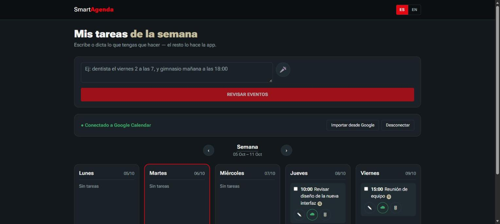
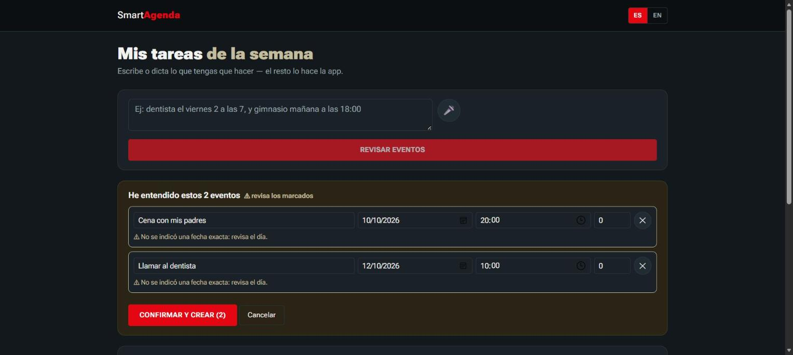
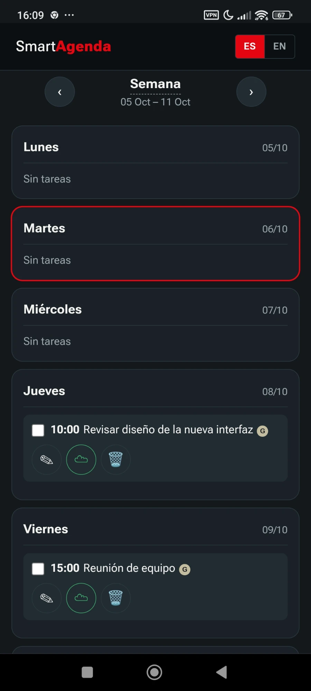

# Smart Agenda


🇪🇸 [Leer en español](README.es.md)

A self-hosted, bilingual (ES/EN) task manager that turns a single free-form
sentence — typed or spoken — into one or more calendar events, with a
confirmation step before anything is saved or synced to Google Calendar.
Built with Blazor Server, a custom natural-language parsing engine, and a
fully local, offline speech-to-text pipeline (no paid APIs, no external AI
services, no data leaving your own network).

<p align="center">
  
</p>
<p align="center">
  
  
</p>
<p align="center">
  <sub>Review-before-confirm step (left) · same app on mobile, installed as a PWA (right)</sub>
</p>

## Why this project is interesting

- **Bilingual natural-language understanding without a paid NLP/AI API.**
  Both the Spanish and English parsing engines are built from scratch with a
  shared rule-based algorithm (date/time/weekday resolution, multi-event
  segmentation, ambiguity detection) and language-specific vocabulary/regex
  tables — not a wrapper around an LLM. Everything is interpreted
  server-side in C#.
- **Fully local, offline voice pipeline.** Audio is captured in the browser
  with the raw Web Audio API (not the browser-only `SpeechRecognition` API,
  which only works well in Chrome), uploaded to the server, filtered through
  a voice-activity-detection model ([Silero VAD](https://github.com/snakers4/silero-vad),
  via ONNX Runtime) and transcribed with [OpenAI Whisper](https://github.com/openai/whisper)
  running locally ([Whisper.net](https://github.com/sandrohanea/whisper.net)).
  No API key, no per-request cost, no audio ever leaves the server.
- **Two-way Google Calendar sync** via OAuth2 — create, update, delete and
  import events, with the local task list and Google Calendar kept in sync.
- **Responsive, installable UI.** One Blazor component tree serves both the
  desktop and mobile layouts; the app is a installable PWA (manifest +
  service worker) so it behaves like a native app once added to the home
  screen.
- **Designed to be self-hosted at home**, not deployed to a cloud provider:
  the goal is to run this on an always-on machine you already own (a
  Raspberry Pi, an old laptop, a NAS, a desktop) and reach it securely from
  anywhere through a private network layer ([Tailscale](https://tailscale.com),
  currently) — rather than exposing a port to the public internet or paying
  for hosting. See [Remote & mobile access](#remote--mobile-access) below.
- **Real-time, interactive UI with no separate frontend build.** Blazor
  Server renders and updates the UI over a persistent SignalR connection —
  there's no React/Vue/webpack layer, the whole stack (UI + business logic)
  is C#.

## Features

- Write or dictate tasks in natural Spanish or English, including several
  events in a single sentence, with shared temporal context between them
  (e.g. "friday dentist at 7, and gym tomorrow at 6pm").
- A preview/confirmation step before anything is created — ambiguous dates
  (e.g. a bare number with no weekday/month to back it up) are flagged for
  review instead of silently guessed.
- Voice dictation that auto-starts transcription and auto-stops recording
  on silence — no extra clicks needed, and it works in any modern browser,
  not just Chrome.
- A language switch (ES/EN) in the header that changes the UI, the parser's
  language, and Whisper's transcription language together, persisted per
  browser.
- Weekly view with per-day task lists, editable in place, with a Google
  Calendar sync badge per task.
- Google Calendar connect/disconnect flow, manual sync, and import of
  existing Google Calendar events into the app.

## Tech stack

| Layer | Technology |
|---|---|
| UI / server | C# 13, .NET 9, Blazor Server (interactive server render mode) |
| Calendar integration | Google Calendar API v3, OAuth2 (`Google.Apis.*`) |
| Speech-to-text | [Whisper.net](https://github.com/sandrohanea/whisper.net) (local Whisper inference, "small" model) |
| Voice activity detection | [Silero VAD](https://github.com/snakers4/silero-vad) via `Microsoft.ML.OnnxRuntime` |
| Audio capture | Web Audio API (`AudioContext`, `getUserMedia`), custom WAV encoding in JS |
| Natural language parsing | Custom regex-driven engine (no external AI/LLM), one rule set per language |
| Storage | Flat JSON files on disk, one per date |
| Web server / hosting | Kestrel, with HTTPS over a Tailscale certificate for LAN/remote access |
| Client experience | PWA (manifest + service worker), responsive CSS, CSS custom properties for theming |

## Architecture at a glance

```
Browser (desktop or mobile)
   │  text input / recorded audio (Web Audio API)
   ▼
Blazor Server circuit (SignalR)
   │
   ├─ ParserLenguajeNaturalService   → turns text into one or more proposed events
   ├─ TranscripcionAudioService      → Whisper (local) turns audio into text
   ├─ DeteccionVozService            → Silero VAD filters out non-speech audio
   ├─ TareaStorageService            → reads/writes tasks as JSON, one file per date
   └─ GoogleCalendarService          → OAuth2 + Google Calendar API sync
```

Everything above the storage layer runs server-side; the browser only
captures input (text/audio) and renders the UI that Blazor Server streams
back over the SignalR connection.

## Getting started

From inside this folder (`C#/SmartAgenda`):

```bash
dotnet run
```

Or from the repository root:

```bash
dotnet run --project "C#/SmartAgenda"
```

Open the URL the console prints (by default `http://localhost:5203`).

### Natural language examples

```
thursday send the report at 10am
tomorrow remind me to call the dentist at 4pm for 2 hours
dentist friday the 2nd at 7, and gym tomorrow at 6pm
dentist appointment at seven in the morning on friday october 2nd,
trip with my colleagues on sunday the 4th at noon, and dinner
with my parents on the first at 8pm
```

The parser understands, in both languages:

- Weekdays, `today`/`hoy`, `tomorrow`/`mañana`, `day after tomorrow`/`pasado
  mañana`, `this friday`/`este viernes`, `next monday`/`el próximo lunes`,
  `in 3 days`/`dentro de 3 días`.
- Explicit dates: `october 2nd`, `the first`, `the 4th` — once a month is
  mentioned, later dates in the same sentence inherit it automatically.
- Times as digits or words: `at 10`, `10am`, `at seven in the morning`.
- Duration with `for 1 hour`, `for 30 minutes` (defaults to 1 hour).
- Several events separated by commas/"and" — each one is detected
  separately, unless the piece after the separator has no date/time of its
  own (then it's folded into the previous event's title).

After typing or dictating, click **"Review events"**: the app shows a
preview of what it understood (title, date, time and duration are all
editable) before saving anything. Events flagged with ⚠️ didn't carry a
clear date of their own — review those before confirming. Nothing is saved
or sent to Google Calendar until you click **"Confirm and create"**.

> **Known limitation**: the parser is rule-based (no external AI, free, no
> API keys), so a bare number that isn't a date (e.g. "buy 2 coffees") can
> be misread as a day of the month. Always check the preview before
> confirming — which is exactly why that step exists.

Tasks are stored as one JSON file per exact date inside `Data/tareas/`, so
every week — past or future — is independent.

## Remote & mobile access

The app always runs on one machine; your phone (or any other device) just
connects to it. **The intended deployment is a small always-on home
server** — a Raspberry Pi, an old laptop, a NAS, a spare desktop — so the
agenda is reachable 24/7 without needing your main PC to stay on. Right now
it's being run and demoed from a development machine, reached securely over
Tailscale; moving the same setup to a Raspberry Pi (.NET 9 runs natively on
ARM64 / Raspberry Pi OS 64-bit) is a matter of publishing the app there and
pointing Tailscale at it.

**Tailscale is the recommended way to reach it**, whatever machine it ends
up running on: it avoids installing certificates by hand and works from
outside your home network too.

### Option A: Tailscale (recommended)

[Tailscale](https://tailscale.com) creates a private network between your
own devices and gives your server a **real, automatically-trusted** HTTPS
certificate (via Let's Encrypt) — your phone doesn't need to install or
trust anything manually, it just opens the URL like any other website.
Free for personal use.

1. Install Tailscale on the server and on your phone ([tailscale.com/download](https://tailscale.com/download)) and sign in with the **same account** on both.
2. At [login.tailscale.com/admin/dns](https://login.tailscale.com/admin/dns), enable **"MagicDNS"** and **"HTTPS Certificates"**.
3. On the server, find your Tailscale domain:
   ```powershell
   & "C:\Program Files\Tailscale\tailscale.exe" status
   ```
   You'll see something like `my-server` — your full domain is
   `my-server.<your-tailnet>.ts.net` (also visible in the admin panel).
4. Generate the certificate (once; Tailscale renews it automatically):
   ```powershell
   & "C:\Program Files\Tailscale\tailscale.exe" cert my-server.your-tailnet.ts.net
   ```
5. Move the two generated files (`*.crt` and `*.key`) into this project's
   `Data/` folder, renamed to `tailscale-cert.crt` and `tailscale-cert.key`.
6. Start the app (`dotnet run`) and, with your phone connected to Tailscale
   (on any network, not just at home), open
   `https://my-server.your-tailnet.ts.net:7094`.

> **Note**: once the Tailscale certificate is active, `https://localhost`
> stops validating (the certificate no longer lists "localhost" as a valid
> domain). Always use your Tailscale URL, even when testing from the server
> itself — thanks to Tailscale/MagicDNS it works there too.

### Install it on your home screen (no URL to type every time)

The app is an installable PWA: in Chrome (Android), open the Tailscale URL,
tap **⋮** → **"Add to Home screen"**. That creates an icon that opens the
app full-screen, no address bar and no URL to type — the target is fixed in
`wwwroot/manifest.webmanifest`.

### Option B: self-signed certificate on your local Wi-Fi

More manual, but doesn't depend on Tailscale. Only works while the phone is
on the **same Wi-Fi network** as the server.

1. **Generate the certificate** (again if the server's local IP changes):
   ```powershell
   .\scripts\generar-certificado-lan.ps1
   ```
   Creates `Data/dev-cert.pfx` (used by the server) and `Data/dev-cert.cer`
   (installed on the phone).

2. **Allow the connection through Windows Firewall** — if the network is
   marked "Public" (the default), the firewall blocks the phone's
   connection. Either:
   - Settings → Network & Internet → Wi-Fi → your network → Network
     profile → switch it to **Private**, or
   - in PowerShell **as administrator**:
     ```powershell
     New-NetFirewallRule -DisplayName "SmartAgenda HTTP" -Direction Inbound -Protocol TCP -LocalPort 5203 -Action Allow -Profile Any
     New-NetFirewallRule -DisplayName "SmartAgenda HTTPS" -Direction Inbound -Protocol TCP -LocalPort 7094 -Action Allow -Profile Any
     ```

3. **Start the app** (`dotnet run`).

4. **Trust the certificate on the phone** — without this, the phone shows
   "not secure" and the microphone stays blocked. Transfer
   `Data/dev-cert.cer` to the phone and install it:
   - **Android**: Settings → Security → More security settings → Encryption
     & credentials → Install a certificate → CA certificate.
   - **iPhone**: open the file to install the profile → Settings → General
     → VPN & Device Management → install the profile → Settings → General →
     About → Certificate Trust Settings → enable full trust.

5. **Open the app from the phone**: `https://YOUR_LOCAL_IP:7094` (find your
   IP with `ipconfig`, look for "IPv4 Address").

> Neither certificate (Tailscale or self-signed) is committed to the
> repository — both are in `.gitignore` because they include a private key.

## Google Calendar setup

Sending tasks to your calendar needs your own OAuth credentials from Google
Cloud (free, for personal use only).

### 1. Create the project in Google Cloud Console

1. Go to [console.cloud.google.com](https://console.cloud.google.com/) and
   sign in with your Google account.
2. Create a new project (e.g. `SmartAgenda`).
3. In the side menu, go to **APIs & Services → Library**, search for
   **Google Calendar API** and click **Enable**.

### 2. Configure the OAuth consent screen

1. Go to **APIs & Services → OAuth consent screen**.
2. Choose **External** and fill in the app name and your email.
3. Under "Test users", add your own Gmail account.
4. Save — you don't need to publish it, test mode is enough for personal
   use.

### 3. Create the credentials

1. Go to **APIs & Services → Credentials → Create credentials → OAuth
   client ID**.
2. Application type: **Desktop app**.
3. Name it and create it. Download the generated JSON.

### 4. Place the file in the project

Rename the downloaded file to `credentials.json` and place it at:

```
Data/credentials.json
```

(the `Data/` folder is created automatically the first time you run the app
if it doesn't exist yet).

### 5. Connect your account (inside the app, once)

Click **"Connect with Google"** in the app. A browser window opens with
Google's official sign-in (that's how any "Sign in with Google" flow works
— for security, Google doesn't allow it inside another application). Sign
in, grant calendar access, and the window closes itself. The permission is
stored locally in `Data/google-token/`, so **you won't need to sign in
again** — the app remembers the connection between runs.

From then on, daily use is: write or dictate the task → click "Review
events" → confirm the preview → it's saved in the app and created as an
event in your Google Calendar, no extra technical steps.

### Edit, delete and import

- **Edit**: every task has an "Edit" button to change its text, day, time
  or duration. If it's connected to Google, the event is updated too.
- **Delete**: removes the task locally and, if it was synced, the Google
  Calendar event too.
- **Import tasks from Google**: pulls in events already on your Google
  Calendar for the current week (e.g. ones created directly from your phone
  or Google's own web UI). Known events are updated, new ones are added as
  tasks.

> `Data/credentials.json` and `Data/google-token/` contain sensitive
> account information: never share them or commit them to a public
> repository.

## Project structure

- `Components/Pages/Home.razor` — main UI (text/voice input, event preview,
  weekly view).
- `Services/ParserLenguajeNaturalService.cs` — the single natural-language
  interpretation point (text, and audio once transcribed): detects one or
  more events, explicit/relative dates, and shared temporal context between
  them, for both Spanish and English.
- `Services/LocalizationService.cs` — UI string translation (ES/EN) and the
  single source of truth for the currently selected language.
- `Services/TareaStorageService.cs` — reads/writes tasks as JSON, one file
  per exact date, plus each week's custom name.
- `Services/GoogleCalendarService.cs` — OAuth2 authentication and event
  sync with Google Calendar.
- `Services/DeteccionVozService.cs` — pre-filter that discards audio
  without real speech (music, noise, silence) using Silero VAD, before
  calling Whisper.
- `Services/TranscripcionAudioService.cs` — transcribes recorded audio to
  text with Whisper, running locally (downloads the models on first run
  into `Data/modelo-voz/`).
- `wwwroot/js/speech.js` — records audio in the browser (standard APIs,
  supported everywhere) and uploads it to `/api/transcribir`; the resulting
  text goes through the same flow as if it had been typed. Also detects
  silence to stop recording automatically.
- `scripts/generar-certificado-lan.ps1` — generates the self-signed
  certificate for local Wi-Fi access (Option B above).
- `Program.cs` — if a Tailscale or self-signed certificate exists in
  `Data/`, configures Kestrel to listen on all network interfaces (not just
  `localhost`) with that certificate.
- `wwwroot/manifest.webmanifest` + `wwwroot/service-worker.js` — make the
  app installable as a PWA ("Add to Home screen" on mobile).

## License

[MIT](LICENSE) — do whatever you want with it.
